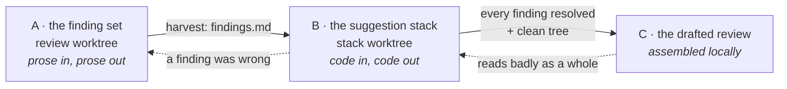
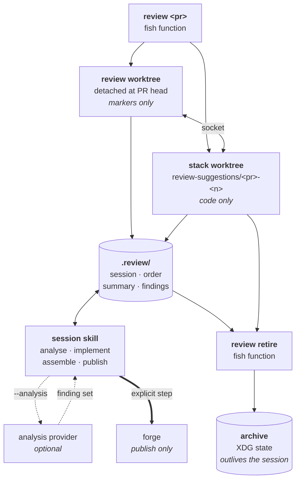

# Local PR review

Review a pull request in the editor, with an AI as a collaborator rather than a
commenter, and ship the outcome as code.

## Purpose

A hosted diff view is a poor reading surface: files in alphabetical order, only the
changed lines, no jump-to-definition, no type information, and removals shown far
from what replaced them. This tooling checks a PR out locally instead, so the whole
editor — language servers, tags, treesitter — is available while reading it.

The second premise is that a review comment describing a fix is weaker than the fix
itself. Findings are therefore delivered as a **stack of real commits** on a separate
branch that the author can take, edit, or drop — not as line-anchored comments.

An AI participates on both sides of that: it drafts findings for the reviewer to
curate, and implements the accepted ones. It never has the final say — every finding
is filtered by a human before implementation, and every implementation is filtered by
a human before it becomes part of the review.

## Concepts

**Two shapes, one set of habits.** A session is the long form: it pins two worktrees to
one PR and ships findings as commits, which is right when a PR deserves hours and far too
much ceremony when it deserves ten minutes. The **skim surface** is the short form — one
worktree per repository that moves from PR to PR, where findings leave as a comment you
paste into GitHub yourself. Both read the same markers with the same keys and sign hunks
against the same kind of base, so moving between them costs no new vocabulary.

| | Skim surface | Review session |
|---|---|---|
| Opened by | `review skim` | `review <pr>` |
| Worktrees | one, per repository | two, per PR |
| Pinned to | nothing — it moves | one PR, one commit |
| Findings leave as | a pasted PR comment (`<Leader>rY`) | commits on a stack branch |
| Survives | until the next PR overwrites it | until `review retire` archives it |

Skimming is also where you find out a PR needs the long form, so `ctrl-r` on a row of the
PR list starts a session for it. The traffic is one-way by design: a session is a
commitment, and nothing about it wants to be demoted back to a glance.

**Review session.** One PR under review. Created by `review <pr>`, which opens two
git worktrees and one editor per worktree. `.review/session.json` in each worktree
records the PR, the role, and the commits the session is pinned to; everything else
reads that file rather than recomputing.

**The two worktrees.** The split is the core of the design, and it exists so that
prose and code can never contaminate each other.

| | Review worktree | Stack worktree |
|---|---|---|
| Checked out at | the PR head, **detached** | branch `review-suggestions/<pr>-<n>` |
| Holds | markers only | code only |
| Commits | never | one per accepted finding |
| Lifetime | archived, then discarded on retire | handed to the author |

Both worktrees contain the same paths, which is why the editor shows its role
permanently in the statusline — a filename alone cannot tell you which tree you are
standing in, and the difference decides whether an edit is a throwaway annotation or
a suggestion.

**The skim worktree.** `.worktrees/skim`, one per repository, detached and never on a
branch — the reviewer is frequently the PR's author, and a branch already checked out in
the main worktree cannot be checked out again. Loading a PR fetches its head to
`refs/skim/<pr>`, outside `refs/heads` so no branch listing ever fills up with it.

It carries no `session.json`; `.review/skim.json` holds the current PR instead, which is
what tells the editor it is standing here and restores the sign base after a restart. It
sits outside `.worktrees/review/`, whose children are all PR numbers to `review list`.

The PR list it opens on (`<Leader>hl`) spans the **whole organisation** rather than this
repository, because that is the question being asked — not "what is open here" but "what
is there to review". Picking a PR in another repository hands it to that repository's own
skim surface, since a worktree belongs to one repository and its toolchain comes from that
repository's direnv environment. An editor already open there is retargeted rather than
duplicated.

**Marker.** A finding, written as a comment in the code under review:

```
REVIEW[3]: this belongs in the domain layer     a finding
REVIEW[3]fix: extract to domain layer           implement as code; the prose never ships
REVIEW[3]ask: why is the retry unbounded?       a question for the author
REVIEW[3]note: check the sibling flow           private; never leaves the worktree
REVIEW[3]                                       another site for finding 3
```

A marker *is* the line it annotates, so it moves when the code moves and needs no
re-anchoring machinery. Markers are the entire medium the reviewer and the AI share.

**Grouping by id.** One id may appear at many sites. The site carrying a body is the
primary; bare ones add locations. This is what turns "wrong in six places" into one
finding rather than six, and it is why ids are never reused or renumbered.

**Accept = commit.** The AI leaves its work **uncommitted**. Committing is the
reviewer's act of acceptance, which buys three things at once: a clean tree is an
unambiguous "nothing in flight" signal, rejecting is free (discard the hunk — there is
no history to rewrite), and the commit is the natural grouping unit for a finding that
spans several files.

**Demonstration.** A code edit the reviewer writes directly in the stack worktree. No
marker, no ceremony — the diff is the message: *like this; now apply it consistently.*

**Implementation record.** A marker says what is wrong; the diff shows what changed.
Neither says which approach was taken and what was ruled out, which version was
actually checked, or what could not be run locally — and that is what lets an author
trust a suggestion instead of re-deriving it. So implementing writes it down, as the
suggestion commit's own message, which is what makes it survive the author
cherry-picking one commit and dropping the rest.

It is written **while implementing**, into `.review/messages/<id>.md`, and the accept
commits that file — subject first, body below, with the editor owning the `REVIEW[n]:`
prefix so a malformed message can never cost a commit its place in the landed set. The
subject says what the change achieves: the marker already carries the problem, and a log
that restates it gives the author nothing to act on.

The reviewer stages only the hunks they agree with, hand-edits, and demonstrates, so what
lands is often not what was written. The message is a file until the accept, which is what
makes that cheap to absorb — each implement step rewrites the messages of findings still
uncommitted, and only a record that has already landed wrong needs an amend. The residue
is an accept taken before the next step could reconcile it, which `assemble` catches.

**Two durable surfaces.** A suggestion stack is usually squashed into the author's
branch, and squashing keeps one message and discards the rest — so a commit body is a
carrier, not a home. What has to outlive it splits by kind:

| | Lives in | Because |
|---|---|---|
| Why the code has this shape | a comment, at the code | the file is read long after the commit is gone |
| What was ruled out, whose call it was, what was verified | the PR description | session context and diff-relative notes may never become comments |

That split is why `assemble` runs a documentation pass over the stack's own change
before building anything — and why that pass is scoped to what the stack introduced.
Turned loose on every changed file it would rewrite the author's comments, and the
stack would arrive carrying prose edits with no finding behind them, in a branch whose
whole claim is that every commit traces to one.

**Round.** One pass of review-and-suggest over a PR, numbered, with its own stack
branch: `review-suggestions/<pr>-1`, then `-2`. A round is continued only while its
branch still descends from the commit under review; once its suggestions have landed
in the PR, or the base moved out from under it, the next session opens a new round
rather than reviving a finished one.

**Retiring.** Ending a session is not the same as removing its worktrees. A session's
reasoning — the summary, the harvested findings, the assembled bodies — lives inside the
review worktree, while its code lives on the stack branch, so removing the worktrees keeps
the code and destroys the reasoning. Retiring copies both out first: every `.review/`
artifact, the markers as a diff, the stack as a patch. The stack branch is kept, because
whether its suggestions still matter is not a judgement a teardown can make — and once the
patch is archived, deleting the branch later is recoverable rather than final.

Archives live **outside** the repository, one directory per round under
`${XDG_STATE_HOME:-~/.local/state}/review/<repo>/<pr>-<round>/`. Outside, because an
archive that `git clean -xdff` can destroy is not an archive.

**Scope.** What "the change" currently means, on the stack: `round` is the uncommitted
work — what the last implement step produced and what there is to accept — and `whole`
is the accumulated suggestion against the PR head. It is a property of the **session**,
read identically by the sign column, the diff view and the work list. A surface that
computes its own range instead reintroduces a gutter and a panel that disagree.

**Work list.** The current scope's changed hunks, as quickfix entries. Hunks whose
changed lines are only markers are excluded, so annotating a file never adds work.

**The `.review/` contract.** The filesystem boundary between the editor, the session
skill and any analysis provider. Gitignored, and a cache rather than a record —
everything in it is either regenerable from the PR or already promoted into the stack.
Both worktrees have a `session.json`; every other artifact lives in the **review**
worktree's copy, so one session means one `.review/`.

| File | Written by | Contents |
|---|---|---|
| `session.json` | `review <pr>` | PR, role, pinned commits, stack branch, socket paths |
| `order.json` | the session | the route through the PR: one entry per changed file |
| `summary.md` | the session | the review as prose: answer first, then themes |
| `policy.json` | the session (optional) | constraints the assembled review must honour |
| `findings.md` | the editor | the harvested marker set, `note` excluded |
| `messages/<id>.md` | `implement` | that suggestion commit's message: what it achieves, what was ruled out, what was verified |
| `out/` | `assemble` | the review artifacts, local until `publish` |

`summary.md` is written answer-first, so its opening block is the whole review in a few
sentences. That block is inlined into the orientation panel and the file is reachable from
there, which is what makes the reasoning available without harvesting — harvesting rewrites
`findings.md` from whatever the marker set currently is, so reaching prose through it would
mean advancing the workflow to read.

**Analysis provider.** Analysis is pluggable, and a provider is a **function**: a PR
goes in, a finding set comes out — an order, the findings with their sites, the review
as prose, optionally a policy. It writes nothing, touches no git state and posts
nothing, so it needs to know nothing about worktrees, editors or suggestion stacks,
and there is no effect it could be told not to perform.

Every effect belongs to the session: allocating ids, rendering findings as markers in
each file's comment syntax, writing `.review/`, refreshing the editor. That keeps
placement mechanics in one place instead of in every provider, and it is why the
built-in analysis and a delegated one converge — they differ only in where the
findings came from. With no provider configured, a built-in light analysis runs, so
the whole loop is exercisable standalone.

Delegation is **adoption, not handoff**: a provider's procedure is read and followed in
place of the built-in one, in the same context. There is no second party, so the
conformance check on a finding set is mechanical only — it catches an omission, never a
misjudgement. Nothing here can independently verify an analysis, and a design that
claimed otherwise would be describing a reviewer that does not exist.

## The loop

Three loops, cheap to expensive. The point of the ordering is that the expensive one
only ever runs on findings a human already approved.



**Loop A — curate the finding set.** The AI drafts markers; the reviewer edits,
retags, deletes and adds. Cheap, so it can go around several times. `<Leader>rw`
harvests the surviving set and is the gate into Loop B.

**Loop B — build the suggestion.** The AI implements one finding at a time as
uncommitted edits in the stack worktree. The reviewer reads the diff, may hand-edit
or demonstrate, then accepts with `:ReviewAccept`. A finding that turns out to be
wrong goes back to Loop A rather than being half-implemented.

**Loop C — draft the review.** Assembled into `.review/out/` and sent only on an
explicit separate step.

## Public surface

### Shell

```
review <pr>
```

Resolves the PR, fetches its head, creates both worktrees, copies in the gitignored
local configuration a fresh worktree lacks (so the toolchain activates), writes
`session.json`, and opens a terminal session with one tab per worktree. Re-running
against the same PR reuses the worktrees, so a session survives closing the editor.

Re-entry after a crash or a stray `:q` is `nvim -c Review` in either worktree — the
session is read from the working directory.

```
review list
review retire <pr> [--force]
```

`list` is how sessions are found once they stop being visible: retiring removes the
worktrees, so nothing in `git worktree list` shows that a review ever happened, and what
survives is a branch and an archive directory in two places nobody would look. Per round it
reports the commit count, whether the worktrees are still up, where the archive is, and
whether deleting the branch would be recoverable.

`retire` refuses rather than forces when something would be lost — uncommitted work in the
stack worktree, an editor still serving on the session's socket, or a shell standing inside
a worktree about to be removed. `--force` overrides the first two.

### Worktree preparation

A fresh worktree has none of the gitignored state a checkout accumulates. Small config files
are copied and dependency directories are symlinked, which covers most of it — but not the
two cases that matter most for reviewing:

- **The language server is often installed into the dependency tree**, not onto `PATH`. A
  worktree without that tree then has no type checking, no definitions and no references at
  all — a far larger failure than unresolved imports, and one that looks like a broken editor
  rather than a missing dependency.
- **Dependency trees routinely pin the first-party import root to an absolute path.** Shared
  or symlinked, that path still names the main checkout, so every first-party import in the
  worktree resolves to whatever the default branch holds. Definitions then open the wrong
  copy of the code under review, silently, and tests run against it.

Materialising a dependency tree correctly is ecosystem-specific, so the repository supplies
it. An executable `.review/setup` in the main checkout is run once per fresh worktree, with
the worktree as its working directory and:

| Variable | |
|---|---|
| `REVIEW_MAIN` | the main checkout, to copy or clone from |
| `REVIEW_PR` | the PR number |
| `REVIEW_ROLE` | `review` or `stack` |

It is retried until it exits `0` — the `.review/setup-done` sentinel is written only on
success, so a hook that failed halfway runs again on the next `review` instead of leaving a
worktree that is silently half-prepared. `.review/` is already ignored, so the hook needs no
ignore entry of its own, and nothing about it reaches this configuration.

### Editor

| Key | Action |
|---|---|
| `<Leader>rp` / `:Review` | where the session stands, the review's opening, and the single next action |
| `<Leader>rc` `rf` `ra` `rn` | new marker: finding · fix · ask · private note |
| `<Leader>rr` | add this location to an existing finding |
| `<Leader>rd` | delete the marker here |
| `¨r` / `år` | next / previous marker in this buffer |
| `<Leader>rl` | the findings, with a preview |
| `<Leader>ro` | the review order, as a work list |
| `<Leader>rq` | the change, hunk by hunk, as a work list |
| `<Leader>rD` | browse the change in a file panel |
| `<Leader>rb` | switch scope: this round or the whole suggestion (stack only) |
| `<Leader>rt` | findings and their states |
| `<Leader>rw` | harvest `findings.md` — summary plus findings — and open it |
| `<Leader>rj` | the same file and line in the other worktree's editor |
| `:ReviewAccept [id]` | commit the staged change as accepted finding `id`; `!` takes the whole change |

Everything that produces a list produces a **quickfix** list, walked by the same
motions as every other quickfix list in the configuration. Populate many ways;
navigate one way.

Hunk staging is the accept mechanism at the line level: stage what you agree with,
then `:ReviewAccept`. In the stack worktree the sign column is the map — unstaged
means not yet accepted, staged means accepted into the next commit, no sign means
committed.

### AI phases

| Phase | Does |
|---|---|
| `analyse` | gets a finding set — built-in or from a provider — then renders it as markers, `order.json` and `summary.md` |
| `implement` | implements accepted findings as uncommitted edits on the stack |
| `assemble` | runs the documentation pass, then writes `out/{pr-body.md,review-body.md,plan.sh}` — **sends nothing** |
| `publish` | runs `plan.sh` and nothing else |
| `help [question]` | read-only diagnosis: where the session stands, and what to do next |

`assemble` is the dry run, and it is the default end of the road: nothing reaches a
remote without `publish` being invoked separately. `plan.sh` is a literal command list
with no logic, so what was read is what gets sent.

`help` is the escape hatch, and it takes a question — *have we desynced, how do I
continue from here.* The orientation panel reports state but cannot reason about it;
`help` reads the same state plus both worktrees' git status and says what to do,
naming any specific disagreement it finds. It never changes anything.

### The handover

Both assembled bodies close by transferring ownership: the stack branch and its PR are
the author's, with full write access, to rebase, amend, squash, extend or discard.

Two things they deliberately never say, because neither is supportable as a blanket
claim: that the suggestions are optional or non-blocking *as a class* — that is a
per-finding judgement, and waiving it up front turns real findings into noise — and
anything inviting the author to open their own PR for work that already exists.

## Architecture



Each editor serves on a socket at a deterministic path derived from the repository
and PR number, so the AI and the other worktree's editor can jump it to a file and
line without a plugin. The path is constructed rather than discovered, and liveness
is established by probing the socket — a killed editor leaves its socket file behind,
so existence proves nothing.

## Invariants

Rules the design depends on. Each is cheap to violate by accident and expensive to
discover afterwards.

**Separation**

- The review worktree never commits. It is kept detached rather than on a branch so
  that not committing is the path of least action.
- The stack worktree never contains a marker. This is what lets its diff be trusted
  as a pure suggestion set with no filtering step.

**Analysis**

- Analysis reads the `base...head` commit range only, never the working tree —
  otherwise re-running it treats the reviewer's own markers and scratch edits as part
  of the PR.
- Analysis never builds, typechecks or runs tests. Verification belongs to the human
  in Loop B.
- A provider performs no effects. It returns a finding set; the session allocates ids,
  renders the markers and writes `.review/`. Placement depends on what is already in
  the worktree, so it cannot be a provider's to get right.
- Re-running analysis adds only uncovered findings, and never touches, renumbers or
  duplicates markers it did not write.
- `order.json` is always regenerated whole. A partial rewrite silently hides the rest
  of the PR from the route.
- Every changed file gets an entry; an entry for a file outside the diff must be
  marked `"context": true`, because the entry count is how the size of the change is
  judged.
- Reviewer edits that are neither markers nor demonstrations are off limits: not
  analysed, not reported, not reverted. Otherwise experimenting is no longer free.

**State**

- The session's PR head is read from what is checked out, never from a freshly
  fetched tip, and is never silently advanced when the PR moves upstream. Advancing
  it leaves every computed range pointing at a commit the worktrees are not on, which
  surfaces as changes in files the review never touched.
- Scope is single per session and every surface reads it.
- A line-numbered list addressing files on disk is anchored to the working tree,
  never to a commit range. The sole exception is the file panel, which renders its
  own buffers. A commit range knows nothing of uncommitted marker lines, so its
  positions drift and land on unchanged code.
- The sign comparison base in the stack worktree stays at its default, the index.
  Naming an explicit revision collapses the staged/unstaged distinction that
  separates *accepted* from *still in flight*.

**Environment**

- A worktree's dependency tree resolves first-party imports to *that worktree*. One still
  pointing at the main checkout makes every definition jump and every test run silently
  address the default branch's copy of the code under review.
- Worktree preparation is idempotent and retried until it succeeds. A half-prepared worktree
  is indistinguishable from a healthy one until a language server fails to start.

**The record**

- A suggestion commit's message may be amended, but only its **message**. The tree must
  survive byte-identical: the reviewer accepted code, and rewriting that under the same
  hash would make acceptance meaningless.
- Amending requires an empty index. `--amend` folds the index in, so amending with
  staged changes swallows the reviewer's next demonstration into the previous finding's
  commit.
- Only `REVIEW[<id>]:` commits at HEAD, and never once the branch has an upstream —
  after publishing, those hashes are shared history.
- A missing record is reported, never reconstructed. A rationale inferred from a diff
  reads exactly like one that was reasoned, and the author cannot tell them apart.

**Teardown**

- Artifacts are archived before any worktree is removed. The review worktree holds the
  only copy of the session's prose, so removing it first is not recoverable.
- The stack branch outlives the session; teardown never deletes it.
- The local PR ref is dropped, not kept. `pull/<pr>/head` remains fetchable from the
  forge after the PR merges and after the author deletes their branch.

**Shipping**

- Nothing reaches a remote except through the explicit `publish` step.
- The reviewed branch is never pushed to. Suggestions exist only on the stack branch.
- A review is submitted as an approval or a comment, never as a blocking request for
  changes.

## Deliberate limits

Approximations that are load-bearing and should not be "fixed" without understanding
why they are here.

- **Which findings have landed is derived from commit subjects, and is a hint rather
  than an authority.** A finding whose commit was later dropped still shows as landed.
  The diff against the stack base is what the review *is*; when the two disagree,
  believe the diff.
- **Uncommitted work is not attributed to individual findings.** It cannot be done
  honestly, and landed-versus-open is the distinction that matters.
- **There is no round counter.** Nothing records how many times the implement step has
  run, so any such number would be invented — and one that silently stopped
  incrementing would mislead more than its absence does. Progress is reported as
  accepted-against-implementable instead.
- **Line numbers are approximate between the two worktrees.** Markers shift one copy,
  suggestions shift the other. Right file, right region.
- **The summary reflects the last analysis, not the current marker set.** Curating
  markers afterwards can leave it describing a theme whose findings were all deleted.
  The findings below it are always regenerated; re-run `analyse` to refresh the prose.
- **`:ReviewAccept!` stages everything**, including stray untracked files in the stack
  worktree.
- **Accept commits skip commit hooks.** A fresh worktree structurally lacks installed
  hook tooling, and the commit is a local suggestion the author's own CI will check
  for real; a blocked accept would strand the change with nowhere to go.
- **Dependencies are symlinked into the worktrees, not installed.** Stale if the PR
  itself changes dependencies — install into the worktree by hand in that case.
- **Whether a stack branch's suggestions landed is never computed.** A squash merge leaves
  its commits unreachable from the base branch, so an ancestry test reads false forever and
  a branch that shipped looks identical to one that was abandoned. Only the reviewed PR's
  own state and the commit count are reported; the judgement stays with the reader.
- **Retiring leaves the session's terminal tabs open**, pointing at directories that no
  longer exist. Closing the window the command was typed in is worse than leaving it.
- **The panel shows the summary's opening, never the whole document.** It is capped, and the
  cap announces itself rather than trimming a sentence. The page is worth opening because it
  can be read at a glance, and a document on it would end that.
- **The panel's summary is as old as the last analysis.** It sits above live marker counts,
  so the prose can describe a theme whose markers were all deleted since. Same staleness as
  the copy embedded in `findings.md`, now visible next to the numbers that contradict it.

## Pointers

- `claude/skills/pr-session/CONTRACT.md` — the `.review/` boundary as a spec, written
  so an analysis provider can be pointed at it alone.
- `claude/skills/pr-session/SKILL.md` — the phase router.
- `nvim/lua/plugins/review.lua` — markers, scope, and every editor surface.
- `fish/functions/review.fish` — session bootstrap and verb dispatch.
- `fish/functions/_review_retire.fish` — archive, then teardown.
- `fish/functions/_review_list.fish` — what sessions exist, live or retired.
